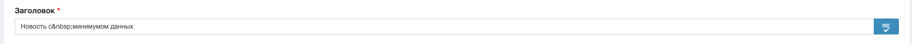
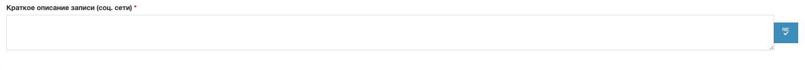
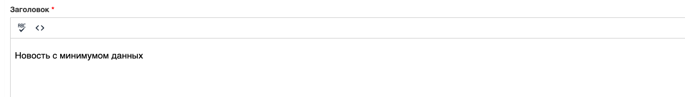

JS-типограф в виде различных виджетов для Yii 2 Framework
==========

Компонент создан для типографирования текста на основе типографа [JS v6.12.1](https://github.com/typograf/typograf)

Установка
---------

Для подключения компонентов в свой код необходимо добавить в _composer.json_ следующий код:
```
"require": {
    "chulakov/yii2-js-typograf": "~1.0.0"
},
...
"repositories": [
    {
        "type": "vcs",
        "url":  "git@git.chulakov.org:OlegChulakovStudio/yii2-js-typograf.git"
    }
]
```

Описание
---------

Пакет содержит реализацию виджетов для разного типа полей формы, 
в том числе визуального редактора TinyMCE.

**Виджет обычного текстового поля:**



**Виджет многострочного текстового поля:**



```php
<?= $form->field($model, "description")->widget(TypografTextAreaWidget::class, [
    'options' => [
        'rows' => '3'
    ]
]); ?>
```

**Виджет текстового редактора на основе TinyMCE**



```php
<?= $form->field($model, "title")->widget(\chulakov\typograf\widgets\TypografTinyMceWidget::class,[
                'clientOptions' => [
                    'min_height' => 500,
                    'plugins' => [
                        'lists',
                        'visualblocks visualchars code nonbreaking',
                        'autoresize',
                        'paste',
                        'link',
                        'typograf',
                        'code'
                    ],
                    'toolbar1' => 'undo redo | formatselect | bold | bullist | nonbreaking removeformat | typograf code | link',
                    'content_css' => '',
                    'menubar' => false,
                    'branding' => false,
                    'paste_as_text' => true,
                    'formats' => [
                        'underline' => ['inline' => 'span', 'classes' => 'underline'],
                        'strikethrough' => ['inline' => 'span', 'classes' => 'strike'],
                    ],
                ]
        ]); ?>
```

